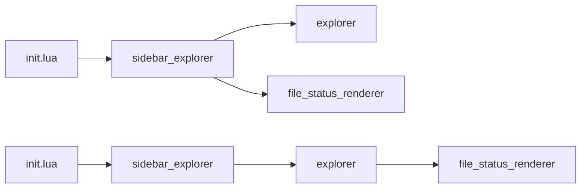

# ADR 002: Explorer Module Boundary

## Status

Accepted

## Date

2026-05-18

## Related Tasks

- `tasks/issues/004-decouple-explorer-module.md`

## Context

`sidebar_explorer.lua` is a single 573-line file that mixes two concerns:
- **File-tree logic**: filesystem scanning, git-ignore lookup, entry collection, root resolution. These are pure data-layer functions with no window or buffer involvement.
- **Sidebar presentation**: buffer creation, keymaps, window open/close, line rendering, highlight application, autocmds.

Splitting these concerns enables the tree logic to be tested without a Neovim window and makes the sidebar a thin consumer of a stable data contract. The key architectural question is where the boundary between the explorer data layer and the sidebar presentation layer sits — specifically, whether `explorer` builds display-ready strings or raw entry data.

## Decision

Extract the file-tree logic into `lua/explorer/init.lua`. The explorer module returns **raw entry tables** — it does not format display strings and does not depend on `ui/file_status_renderer`.

The public API of `lua/explorer/init.lua`:
- `M.build_entries(root, expanded)` — returns `{path, name, type, depth, expanded, ignored, root?}[]`
- `M.scandir(path)` — returns `{name, path, type}[]`
- `M.find_git_root(path)` — returns the nearest `.git` parent directory path or nil
- `M.get_ignored_lookup(root, paths)` — returns `{[path]=true}` for git-ignored paths
- `M.normalize_path(path)` — wraps `vim.fs.normalize`
- `M.path_exists(path)` — wraps `uv.fs_stat`
- `M.resolve_root()` — resolves the project root from the current buffer context

`lua/sidebar_explorer.lua` remains the sidebar integration layer: it `require("explorer")`, calls `build_entries()`, then builds display lines by applying icons and calling `file_status_renderer.get_indicator()` locally.

## Options Considered

1. Explorer returns raw entries; sidebar owns all display rendering (diagram top path). `(recommended)`
2. Explorer builds display-ready lines by calling `file_status_renderer` (diagram bottom path).
3. Keep everything in `sidebar_explorer.lua` — no split.

## Consequences

Positive:
- `lua/explorer/init.lua` is testable without a Neovim window or git process.
- `sidebar_explorer.lua` becomes a thin presentation layer; its logic is easier to follow.
- The explorer module can be reused by a future floating-window or popup picker without changes.

Negative:
- `sidebar_explorer_validation.lua` tests that currently assert display strings must be updated to assert entry data — lines like `assert_equal(lines[1], "▾ ...")` become entry-property checks.
- `sidebar_explorer.lua` gains a local `build_lines()` that calls `explorer.build_entries()` followed by per-entry formatting, which is a small increase in local complexity.

## Validation

- `sidebar_explorer_validation.lua` is rewritten to `require("explorer")` directly and asserts entry properties (type, depth, ignored, name) instead of display strings.
- All six existing test files continue to pass after the split.
- `lua/explorer/init.lua` has no `require("ui.*")` or `require("config")` imports.

## Open Questions

- None. The module boundary and public API are fully determined by the existing `_test` escape hatch and the validation test's usage patterns.
