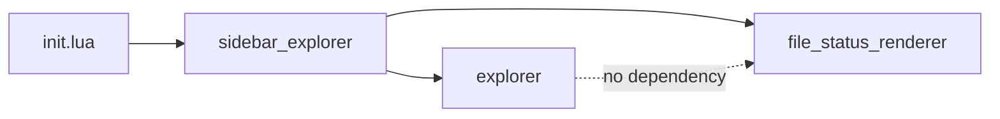

# Task: Decouple file-tree logic into `lua/explorer/` module

## Priority

P0 — Must complete before mouse support (task 005) so the keymap is placed in the correct post-refactor location. Also the first meaningful architectural improvement in this batch.

## Dependencies

- Depends on ADR `docs/adrs/002-explorer-module-boundary.md` — human must accept the ADR before implementation begins.
- No other task dependency; can start immediately after ADR acceptance.

## Assignability

**HITL** — requires human acceptance of ADR `docs/adrs/002-explorer-module-boundary.md` before implementation. The specific decision: does `explorer.build_entries()` return raw entry tables (recommended) or display-ready strings? Once the ADR is accepted, implementation is fully specified and the remaining work is AFK.

## Context

`sidebar_explorer.lua` is a 573-line monolith that mixes file-tree data logic with sidebar window management. The file-tree functions (`scandir`, `find_git_root`, `get_ignored_lookup`, `build_lines`, `resolve_root`, `normalize_path`, `path_exists`) are already partially exposed via the `_test` escape hatch, which means the existing tests already treat them as a distinct layer.

The split creates:
- `lua/explorer/init.lua` — pure data layer: no window, no buffer, no keymaps, no `require("ui.*")`.
- `lua/sidebar_explorer.lua` — thin presentation layer: imports `explorer`, builds display lines locally, manages window/buffer/keymaps/autocmds.

The dashed line documents the intentional absence of a dependency: `explorer` must not import `ui/file_status_renderer` or `config`.

## Use Cases

- **Feature**: Explorer module decoupling
- **Scenario**: Developer tests tree-building logic without a Neovim window
- **Given** `lua/explorer/init.lua` exists as a standalone module
- **When** a test calls `explorer.build_entries(root, expanded)` with a temp directory
- **Then** the test receives a table of raw entries without needing to open any window or buffer

---

- **Scenario**: Sidebar continues to work after the split
- **Given** `sidebar_explorer` now imports `explorer` for tree data
- **When** the user toggles the sidebar with `<leader>e`
- **Then** the sidebar opens, renders correctly, and all keymaps and autocmds work as before

## Definition of Ready

- ADR `docs/adrs/002-explorer-module-boundary.md` is accepted.
- The public API of `explorer` (listed in the ADR Decision section) is confirmed.
- All six existing test files pass before work begins (baseline).

## Functional Requirements

- `FR-001`: A new module `lua/explorer/init.lua` exposes `build_entries`, `scandir`, `find_git_root`, `get_ignored_lookup`, `normalize_path`, `path_exists`, and `resolve_root` as public functions.
- `FR-002`: `explorer.build_entries(root, expanded)` returns the same entry data currently returned by the `entries` table in `sidebar_explorer._test.build_lines`, without display strings.
- `FR-003`: `lua/sidebar_explorer.lua` imports `explorer` and delegates all tree-building and filesystem operations to it. It retains a local `build_lines()` that calls `explorer.build_entries()` and applies icons and `file_status_renderer.get_indicator()` for display.
- `FR-004`: `lua/explorer/init.lua` has no `require` calls to `ui/file_status_renderer`, `ui/gutter_renderer`, or `config`.
- `FR-005`: The `_test` escape hatch on `sidebar_explorer` is removed or replaced to reflect the new module structure; `sidebar_explorer_validation.lua` is updated to `require("explorer")` directly and assert entry properties instead of display strings.

## Non-Functional Requirements

- `NFR-001`: All six existing test suites pass after the split without modification to any file other than `sidebar_explorer.lua`, `sidebar_explorer_validation.lua`, and the new `explorer/init.lua`.
- `NFR-002`: `lua/explorer/init.lua` follows the same Lua style as the existing `lua/git/` and `lua/core/` modules (module table `local M = {}`, explicit `return M`).

## Observability Requirements

Not applicable — this is a refactor with no logging, metrics, or tracing changes.

## Acceptance Criteria

- `AC-001`: **Given** `require("explorer")` is called, **When** `explorer.build_entries(root, {[root]=true})` is called with a valid directory, **Then** it returns a table whose first entry has `type == "directory"`, `depth == 0`, and `root == true`.
- `AC-002`: **Given** `lua/explorer/init.lua` is loaded, **When** its `require` dependencies are inspected, **Then** no `ui.*` or `config` module is imported.
- `AC-003`: **Given** the user opens the sidebar with `<leader>e` after the split, **When** the sidebar renders, **Then** it displays file/directory names, git-ignore dimming, and git status indicators exactly as before.
- `AC-004`: **Given** all six test files are run headlessly, **Then** all six print `ok` and exit with code 0.

## Required Tests

### Unit Tests

- `UT-001`: Call `explorer.build_entries(root, {})` with a collapsed root — assert result has exactly 1 entry, the root directory. Covers `FR-002`, `AC-001`.
- `UT-002`: Call `explorer.build_entries(root, {[root]=true})` with an expanded root containing known files — assert entries include all expected names at correct depths. Covers `FR-002`.
- `UT-003`: Assert `explorer.get_ignored_lookup(root, paths)` marks git-ignored files and excludes tracked files. Covers `FR-001`. (Migrated from `sidebar_explorer_validation.lua`.)
- `UT-004`: Assert `explorer.resolve_root()` returns the nearest project marker root when a git repo ancestor exists. Covers `FR-001`. (Migrated from `sidebar_explorer_validation.lua`.)

### Integration Tests

- `IT-001`: **Scenario**: Sidebar renders identically before and after the split  
  **Given** all six existing test suites pass before the refactor  
  **When** the refactor is applied  
  **Then** all six suites still pass and no assertion changes except `sidebar_explorer_validation.lua`  
  Covers `NFR-001`, `AC-004`.

### Smoke Tests

Not applicable — no deploy or startup surface; headless tests cover availability.

### End-to-End Tests

Not applicable — the split is a structural refactor with no new user-visible behavior.

### Regression Tests

- `REG-001`: **Scenario**: Sidebar renders file names, git-ignore dimming, and status indicators after the split  
  **Given** the post-split `sidebar_explorer.lua` is loaded  
  **When** `sidebar_explorer_validation.lua` tests pass  
  **Then** the decoupling has not broken any previously verified behavior  
  Covers `AC-003`, `AC-004`.

### Performance Tests

Not applicable — no measurable performance constraint introduced.

### Security Tests

Not applicable — no authentication, authorization, or trust-boundary changes.

### Usability Tests

Not applicable — no user-visible behavior change.

### Observability Tests

Not applicable — no logs, metrics, or analytics introduced or modified.

## Definition of Done

- `lua/explorer/init.lua` exists with the full public API from the ADR.
- `lua/sidebar_explorer.lua` delegates all filesystem/tree operations to `explorer`.
- `sidebar_explorer_validation.lua` is updated: `require("explorer")` replaces `require("sidebar_explorer")`, display-string assertions are replaced with entry-property assertions.
- All six test suites pass headlessly.
- `lua/explorer/init.lua` contains no `require("ui.*")` or `require("config")` imports.
- ADR `docs/adrs/002-explorer-module-boundary.md` is updated from `Proposed` to `Accepted`.
